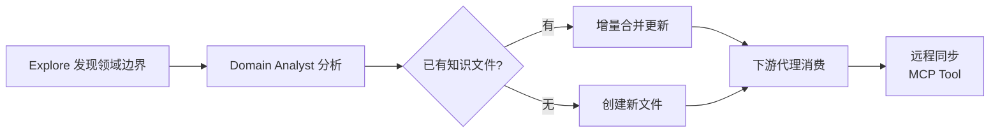

# Naruto — 多代理需求开发流水线

[](https://opensource.org/licenses/MIT)
[]()
[]()

**Naruto** 是一款 OpenCode 插件，实现了一个多代理（Multi-Agent）需求开发流水线。它能将原始需求自动转化为生产就绪的代码，全程由 7 个专业化 AI 代理协作完成。

---

## 特性一览

- **端到端自动化** — 从需求澄清到代码审查，全流程自动推进
- **8 个专业化代理** — 每个阶段由专精该领域的 AI 代理负责
- **审批关卡** — PRD 和技术设计阶段支持人工审核，确保方向正确
- **[Compound Knowledge](#compound-knowledge复合领域知识)** — 自动分析跨系统调用链、状态机、数据模型并积累为可复用的领域知识文件
- **状态持久化** — 流水线状态持久化到磁盘，支持断点恢复
- **灵活配置** — 可为每个代理指定不同的模型和参数，优化成本与质量
- **渐进式执行** — 支持运行完整流水线，也支持单独执行某个阶段

---

## 安装

### 前提条件

- [OpenCode](https://opencode.ai) 已安装并配置
- [Bun](https://bun.sh) 运行时（推荐 1.3+）

### 远程安装（推荐）

```bash
bun add @zhoudqa/naruto
```

然后在 OpenCode 配置（`~/.config/opencode/config.json` 或项目 `.opencode/config.json`）中添加：

```json
"plugin": ["@zhoudqa/naruto"]
```

### 本地开发

如需修改 Naruto 源码，请使用以下方式：

```bash
git clone git@github.com:zhoudqa/naruto.git
cd naruto
bun install
bun run build
```

然后在 OpenCode 配置中将插件路径指向本地构建产物：

```json
"plugin": ["./naruto/dist/index.js"]
```

### 发布新版本

```bash
npm version patch   # 小改版：0.1.0 → 0.1.1
npm version minor   # 功能新增：0.1.0 → 0.2.0
npm version major   # 大版本：0.1.0 → 1.0.0
git push --follow-tags
```

推送 tag 后，GitHub Actions 会自动构建并发布到 npm。

---

## 快速开始

使用 `/develop` 命令启动完整流水线：

```
/develop 为用户添加邮箱密码登录功能
```

也可以从指定阶段开始：

```
/develop --from tech-design 为用户添加邮箱密码登录功能
```

恢复之前中断的流水线：

```
/develop --resume
```

---

## 命令参考

Naruto 注册了以下 OpenCode 斜杠命令：

| 命令 | 说明 |
|------|------|
| `/develop` | 运行完整流水线：clarify → explore → domain-analysis → prd → tech-design → code → test → review |
| `/prd` | 仅生成 PRD（运行 explore + domain-analysis + prd 阶段） |
| `/tech-design` | 仅生成技术设计（运行 explore + domain-analysis + tech-design 阶段） |
| `/code` | 仅编码实现（需先有 PRD 和技术设计） |
| `/test` | 仅编写并运行测试（需先有技术设计和代码） |
| `/review` | 仅执行代码审查（需先有 PRD、技术设计和代码） |
| `/naruto-export` | 手动触发 AGENTS.md 导出 |

---

## 流水线阶段

Naruto 的流水线包含 8 个顺序执行的阶段：

| 阶段 | 代理 | 说明 | 审批关卡 |
|------|------|------|----------|
| **Clarify** | Coordinator | 通过对话澄清需求，生成结构化需求摘要，识别业务域 | ❌ |
| **Explore** | Explorer | 只读探索代码库，收集架构、模式、约定等上下文（可消费已有 Domain Knowledge） | ❌ |
| **Domain Analysis** | Domain Analyst | 分析跨系统调用链、状态机、数据模型，生成/更新 Domain Knowledge 文件 | ❌ |
| **PRD** | PRD Writer | 编写产品需求文档，包含用户故事、验收标准 | ✅ 可配置 |
| **Tech Design** | Tech Designer | 设计技术方案，包含架构、API、数据模型、文件级实现计划 | ✅ 可配置 |
| **Code** | Coder | 根据技术设计编写生产级代码 | ❌ |
| **Test** | Tester | 编写并运行单元测试，报告测试结果 | ❌ |
| **Review** | Reviewer | 审查代码与设计的符合度，生成审查报告 | ❌ |

每个阶段由专门的 AI 代理处理，上一阶段的输出自动传递给下一阶段。

---

## Compound Knowledge（复合领域知识）

Naruto 的 **Compound Knowledge** 机制能在每次流水线执行中自动分析跨系统的调用链、状态机、数据模型，并将分析结果沉淀为可复用的领域知识文件，实现知识跨流水线持续积累。

### 工作原理



1. **自动发现** — Explorer 代理识别当前需求所属的业务域
2. **深度分析** — Domain Analyst 代理分析代码库中的跨系统调用链、状态迁移、数据模型及业务规则
3. **增量积累** — 新分析结果与已有 `~/.naruto/domain-knowledge/<domain>.md` 文件合并，只增不减
4. **上下文注入** — 后续流水线的 PRD Writer / Tech Designer / Coder 自动加载相关知识，确保设计一致性
5. **远程同步（可选）** — 支持通过 MCP Tool 将知识同步到外部知识库（Wiki、Notion 等）

### 包含的内容

每个 Domain Knowledge 文件涵盖以下维度：

| 维度 | 说明 | 示例 |
|------|------|------|
| **调用链** | 跨服务/模块的关键调用路径 | `OrderService → PaymentGateway → Ledger` |
| **状态机** | 业务实体的生命周期与状态转换规则 | `订单: PENDING → PAID → SHIPPED → DELIVERED` |
| **数据模型** | 核心实体及其关系 | `User 1:N Order N:1 Payment` |
| **业务规则** | 领域特定的约束和逻辑 | `优惠券不可与秒杀叠加使用` |
| **集成点** | 外部系统接口与协议 | `支付网关 REST API v3, HMAC 签名` |
| **边界上下文** | 限界上下文划分与上下游依赖 | `库存上下文 依赖 商品上下文` |

### 文件存储

```
~/.naruto/domain-knowledge/
├── payment.md          # 支付领域知识
├── auth.md             # 认证领域知识
├── order.md            # 订单领域知识
└── notification.md     # 通知领域知识
```

### 相关配置

```jsonc
{
  // Domain Knowledge 远程同步 MCP tool 名称（可选）
  "knowledge_sync_tool": "wiki_upload"
}
```

---

## 配置参考

在项目根目录的 `.opencode/naruto.jsonc` 中进行配置（JSONC 格式，支持注释）：

```jsonc
{
  // 需要人工审批的阶段（默认：PRD 和技术设计）
  "approval_gates": ["prd", "tech-design"],

  // 始终跳过的阶段
  "skip_stages": [],

  // 各代理的模型和参数覆盖
  "agents": {
    "explorer": {
      "model": "gpt-4o-mini",     // 使用轻量模型节约成本
      "temperature": 0.2
    },
    "domain-analyst": {
      "model": "gpt-4o",          // 跨系统分析使用强模型
      "temperature": 0.3
    },
    "tech-designer": {
      "model": "gpt-4o",          // 使用强推理模型保证设计质量
      "temperature": 0.3
    },
    "reviewer": {
      "model": "gpt-4o"           // 代码审查使用强模型
    }
  },

  // 产物输出目录（默认：.naruto）
  "artifact_dir": ".naruto",

  // AGENTS.md 输出路径
  "agents_md_path": ".naruto/AGENTS.md",

  // 审查完成后自动导出 AGENTS.md
  "agents_md_auto_export": true,

  // Domain Knowledge 远程同步 MCP tool 名称（可选）
  "knowledge_sync_tool": "wiki_upload"
}
```

### 配置加载优先级

配置按以下优先级合并（高优先级覆盖低优先级）：

1. **项目配置** — `.opencode/naruto.jsonc`
2. **用户配置** — `~/.config/opencode/naruto.jsonc`
3. **默认值** — Naruto 内置默认值

### 可用的代理名称

用于 `agents` 配置中的键名：

- `coordinator` — 主协调器
- `explorer` — 代码库探察器
- `domain-analyst` — 领域知识分析师
- `prd-writer` — PRD 编写器
- `tech-designer` — 技术设计师
- `coder` — 编码器
- `tester` — 测试器
- `reviewer` — 审查器

---

## 产物说明

流水线运行过程中会在 `.naruto/` 目录下生成以下产物：

| 文件 | 说明 |
|------|------|
| `.naruto/pipeline.json` | 流水线状态（支持断点恢复） |
| `.naruto/artifacts/context.md` | 代码库上下文（Explore 输出） |
| `.naruto/artifacts/prd.md` | 产品需求文档（PRD Writer 输出） |
| `.naruto/artifacts/tech-design.md` | 技术设计文档（Tech Designer 输出） |
| `.naruto/artifacts/review.md` | 代码审查报告（Reviewer 输出） |
| `~/.naruto/domain-knowledge/<domain>.md` | 领域知识文件（Domain Analyst 输出，跨系统调用链/状态机/数据模型） |
| `.naruto/AGENTS.md` | 供 AI 代理使用的项目上下文摘要（自动导出） |

---

## 技术栈

- **语言**: TypeScript (ESNext, Strict Mode)
- **运行时**: Bun
- **框架**: @opencode-ai/plugin ^1.4.0, @opencode-ai/sdk ^1.4.0
- **验证**: Zod ^3.23.0
- **配置**: jsonc-parser ^3.3.1

---

## 许可证

[MIT](LICENSE)
